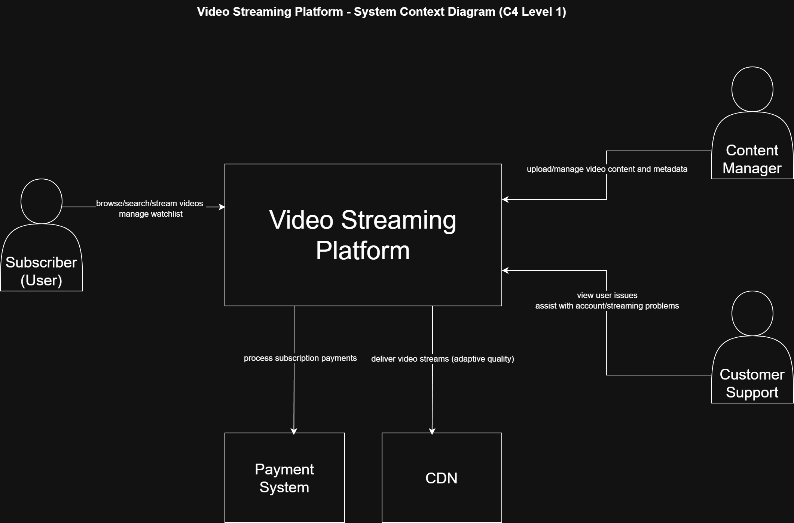
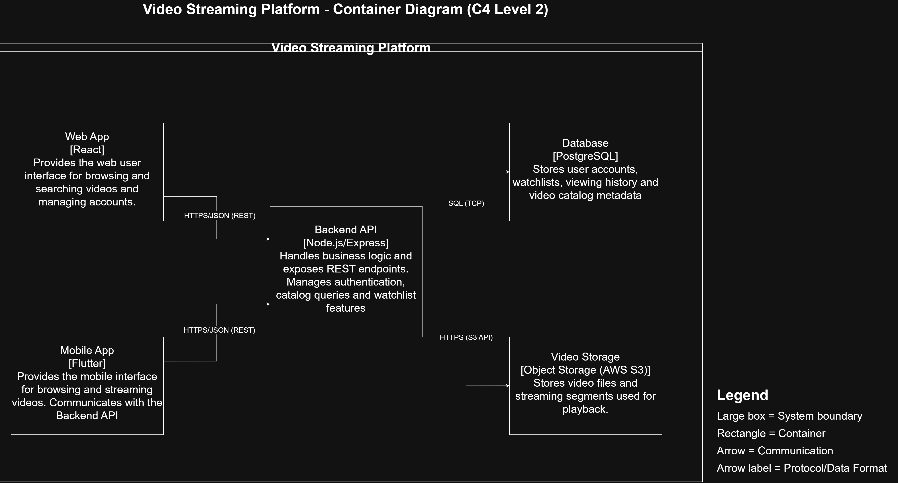
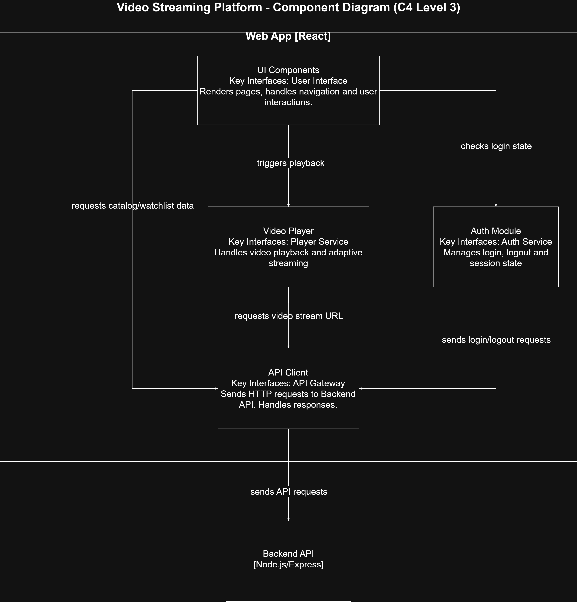
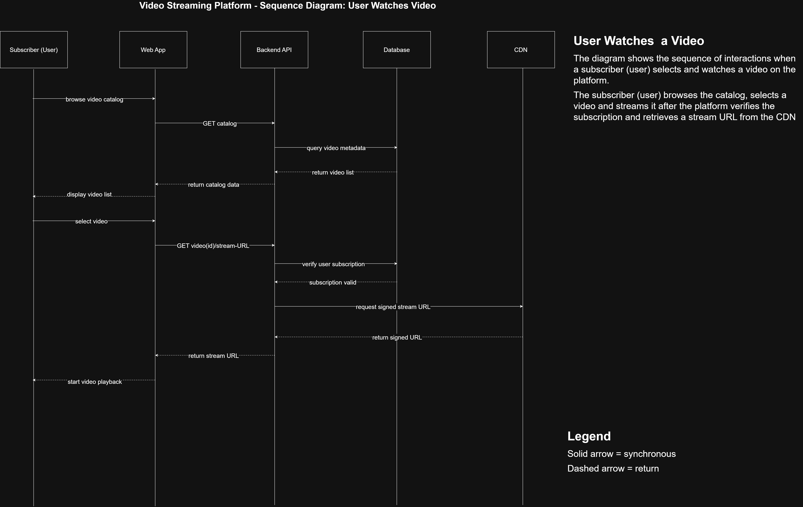
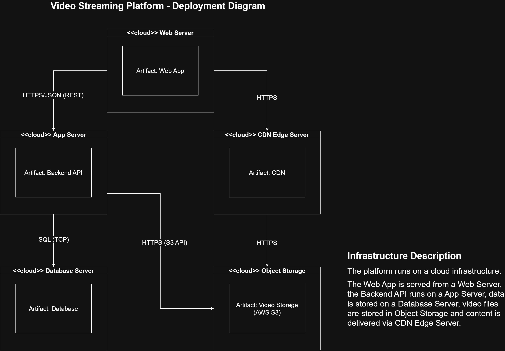

# Part 3 - Architecture Documentation
# Task 3.1 - Model Documentation (Video Streaming Platform)

## a) Modeling Approach

### Notations Used
- **C4 Model**
  - **Level 1 (System Context):** shows the platform boundary, people, and external systems.
  - **Level 2 (Container):** shows the major runtime/deployable building blocks (apps, API, DB, storage) and how they communicate.
  - **Level 3 (Component):** decomposes one container (in this submission: the Web App) into internal components and their dependencies.
- **UML**
  - **Sequence Diagram:** shows time-ordered interactions for the use case "User watches a video".
  - **Deployment Diagram:** shows infrastructure nodes, deployed artifacts, and network connections.

### Why These Notations
- They were expected to be used in this assignment.

- C4 was chosen because it gives a clean, hierarchical "zooming-in" path:
  Context --> Containers --> Components, which makes it easy to communicate with different audiences.
  
- UML was used where behavior and infrastructure matter:
  - **Sequence** captures runtime interactions and API calls in a single use case flow.
  - Deployment makes the physical runtime environment explicit (nodes, artifacts, and protocols). 

### How the Diagrams Relate

The diagrams describe the system from different perspectives and levels of detail.

- **C4 Level 1 (Context)** shows the platform at a high level, including users and external systems.  
- **C4 Level 2 (Container)** breaks the platform into its main containers such as the Web App, Backend API, and Database.  
- **C4 Level 3 (Component)** focuses on the internal components of the Web App container.
- **Sequence Diagram** shows how these parts interact when a user watches a video.
- **Deployment Diagram** shows how the system is deployed on the infrastructure.

Overall, the **C4 diagrams** describe the structure of the system at different levels, while the **UML diagrams** show system behavior and deployment.

---

## b) Diagram Index

**System Context Diagram (C4 Level 1)**  
Type: C4 Model  
Purpose: Shows the overall system boundary, the users interacting with the platform, and external systems such as the CDN and payment system.  
Audience: Stakeholders and developers.
Reference: 

**Container Diagram (C4 Level 2)**  
Type: C4 Model  
Purpose: Shows the main containers of the platform such as the Web App, Mobile App, Backend API, Database, and Video Storage, and how they communicate with each other.  
Audience: Developers and system architects.
Reference: 

**Component Diagram - Web App (C4 Level 3)**  
Type: C4 Model  
Purpose: Shows the internal components of the Web App container, including UI components, the video player, the authentication module, and the API client.  
Audience: Developers.
Reference: 

**Sequence Diagram - User Watches Video**  
Type: UML Sequence Diagram  
Purpose: Shows the interaction flow when a user browses the catalog, selects a video, the system verifies the subscription, and retrieves a stream URL from the CDN.  
Audience: Developers and testers.
Reference: 

**Deployment Diagram**  
Type: UML Deployment Diagram  
Purpose: Shows the infrastructure setup of the platform including servers, storage, and network connections between them.  
Audience: Developers and DevOps engineers.
Reference: 

---

## c) Consistency Check

### How Consistency Was Ensured

Consistency between the diagrams was maintained mainly by using the same names for the main system elements. 
For example, components such as Web App, Backend API, Database, CDN, and Object Storage appear across multiple diagrams and represent the same parts of the system.

The protocols used between components are also consistent. The Web App communicates with the Backend API using HTTPS/JSON (REST). The Backend API connects to the Database using SQL over TCP and communicates with Object Storage using HTTPS (S3 API). The CDN retrieves video files from Object Storage over HTTPS.

Responsibilities are also aligned between the diagrams. The Backend API handles business logic such as subscription validation, which is shown in the sequence diagram. The CDN and Object Storage are responsible for video storage and delivery, which is reflected in the container, sequence, and deployment diagrams.

---

### Assumptions and Simplifications

Authentication details are not modeled in detail. For example, token or session management is not shown in the diagrams.

Video streaming is represented in a simplified way. Instead of modeling streaming protocols in detail, the system simply retrieves a stream URL from the CDN.

Video files are stored in Object Storage, which represents a cloud storage service such as S3.

---

## Diagrams

### 1) System Context Diagram (C4 Level 1)

### 2) Container Diagram (C4 Level 2)

### 3) Component Diagram - Web App (C4 Level 3)

### 4) Sequence Diagram - User Watches Video

### 5) Deployment Diagram
