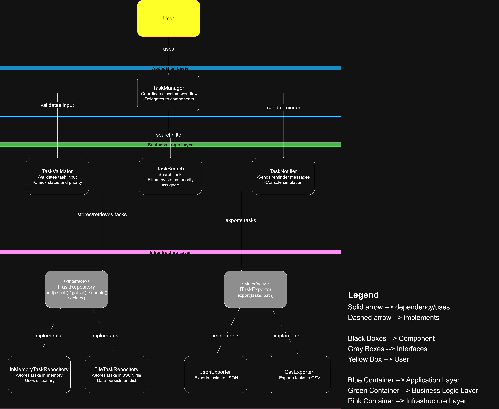

# Task 2.2 – Cohesion and Coupling Analysis

## A) Cohesion Analysis

### TaskManager
Cohesion type: Functional cohesion  

TaskManager coordinates the workflow of the application. It calls the validator, search component, repository, exporter, and notifier when needed.  
It has high cohesion because all of its methods are related to managing the overall task workflow.

### TaskValidator
Cohesion type: Functional cohesion  

TaskValidator is responsible only for validating task data. It checks fields such as title, and it validates status and priority during updates. All logic inside this component is related to validation, so it has high cohesion.

### TaskSearch
Cohesion type: Functional cohesion  

TaskSearch handles searching and filtering tasks. It supports filtering by status, priority, and assignee.  
All methods focus on searching tasks, which gives it high cohesion.

### TaskNotifier
Cohesion type: Functional cohesion  

TaskNotifier sends reminder messages (currently simulated using console output).  
Its only responsibility is notifications, so the component is highly cohesive.

### Repository Components
Cohesion type: Functional cohesion  

**InMemoryTaskRepository** and **FileTaskRepository** manage storing and retrieving tasks.  
All methods in these classes are related to storing and retrieving tasks, which gives them strong cohesion.

### Exporter Components
Cohesion type: Functional cohesion  

**JsonExporter** and **CsvExporter** are responsible for exporting tasks to different formats.  
Each exporter focuses only on exporting tasks to a specific format, which results in high cohesion.

---

## B) Coupling Analysis

### TaskManager and other components
Coupling level: Low  

TaskManager coordinates other components but does not implement their logic.  
Validation, searching, exporting, notifications, and storage are delegated to separate components, which keeps dependencies simple.

### TaskManager and ITaskRepository
Coupling level: Low  

TaskManager depends on the **ITaskRepository** interface instead of a specific repository implementation.  
This allows switching between **InMemoryTaskRepository** and **FileTaskRepository** without changing TaskManager.

### TaskManager and ITaskExporter
Coupling level: Low  

TaskManager uses the **ITaskExporter** interface.  
This makes it possible to change the export format (JSON or CSV) without modifying the manager.

### Possible improvements
If more time was available, interfaces could also be added for:

- TaskValidator
- TaskSearch
- TaskNotifier

This would reduce coupling even further and make the architecture more consistent.

---

## C) SRP Application

### TaskManager
Responsibility: Coordinate the task management workflow.  
Reason to change: If the overall workflow of the application changes.

### TaskValidator
Responsibility: Validate task input data.  
Reason to change: If validation rules change.

### TaskSearch
Responsibility: Search and filter tasks.  
Reason to change: If search or filtering logic changes.

### TaskNotifier
Responsibility: Send reminder notifications.  
Reason to change: If the notification mechanism changes.

### Repository classes
Responsibility: Store and retrieve tasks.  
Reason to change: If the storage method changes.

### Exporter classes
Responsibility: Export tasks to a specific format.  
Reason to change: If the export format changes.

## Diagram

